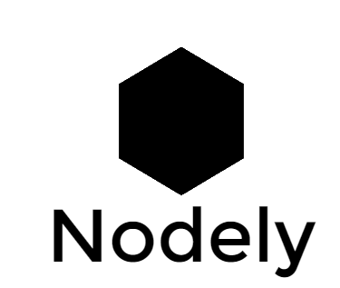

# 

## Synopsis

Nodely is a start skeleton made from NodeJs consisting of ExpressJs, Passport, MongoDB and Mongoose.

## Motivation

Thought about making a starter template that is quite handy to start any project

## API Reference

* NodeJS (https://github.com/nodejs)
* ExpressJs (https://github.com/expressjs/express)
* Passport (http://passportjs.org/)
* MongoDB (https://www.mongodb.com/)
* Mongoose (http://mongoosejs.com/)

## Contributor(s)

* Zubair Ahmed

## License

WTFPL – Do What the Fuck You Want to Public License

